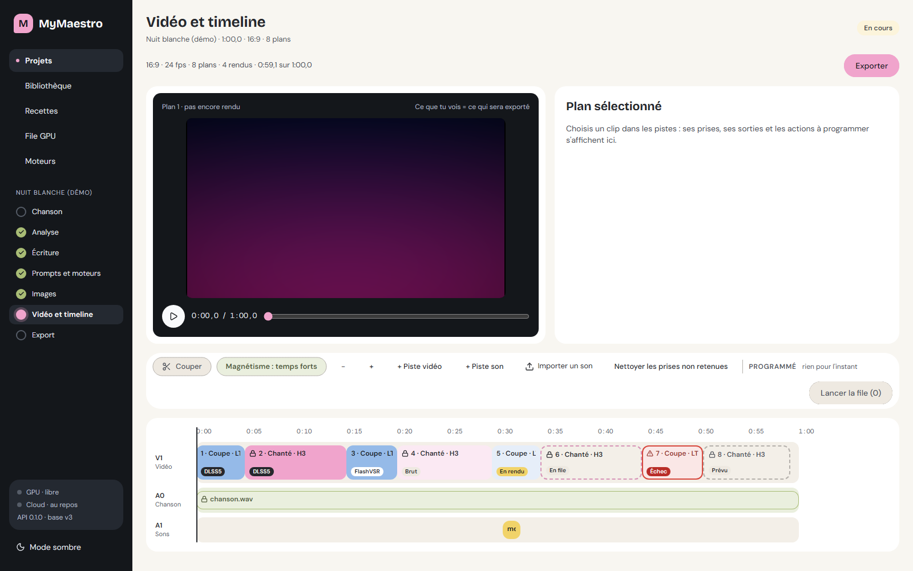
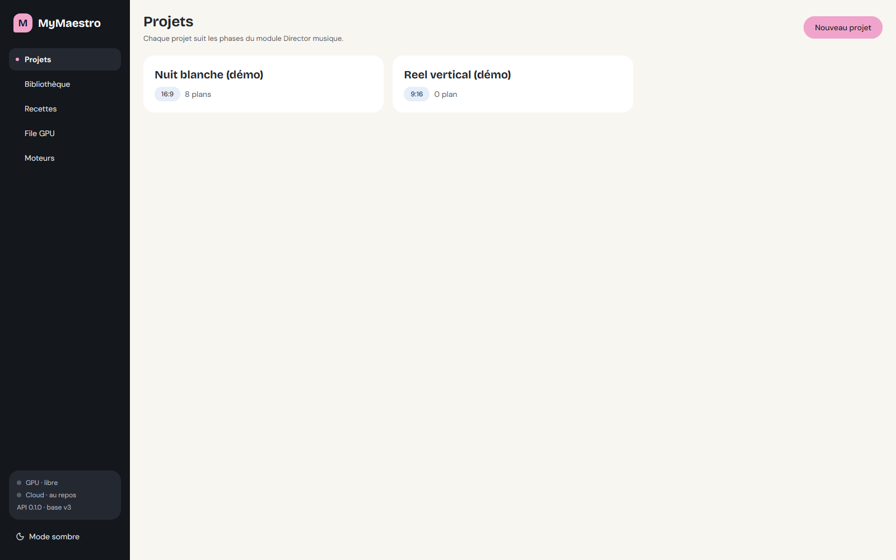
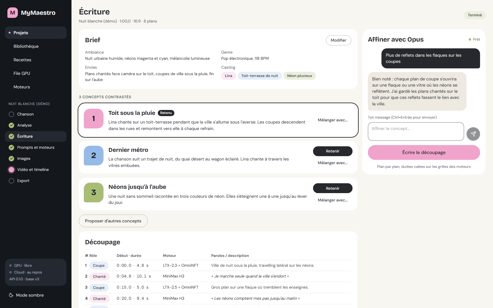
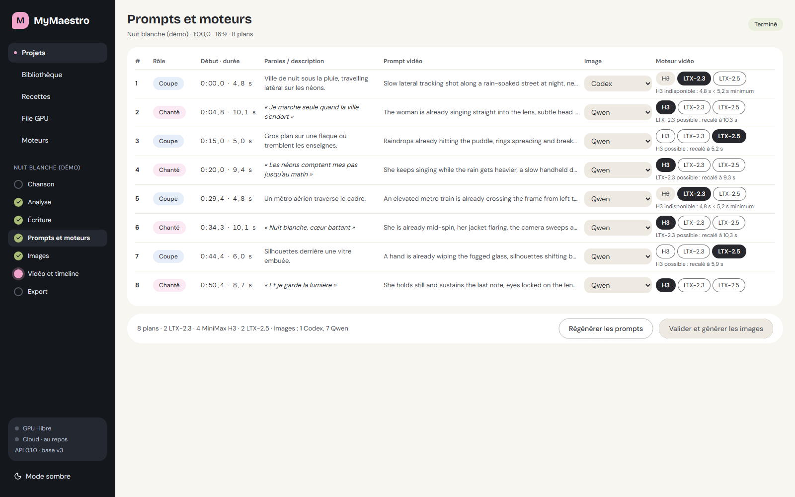
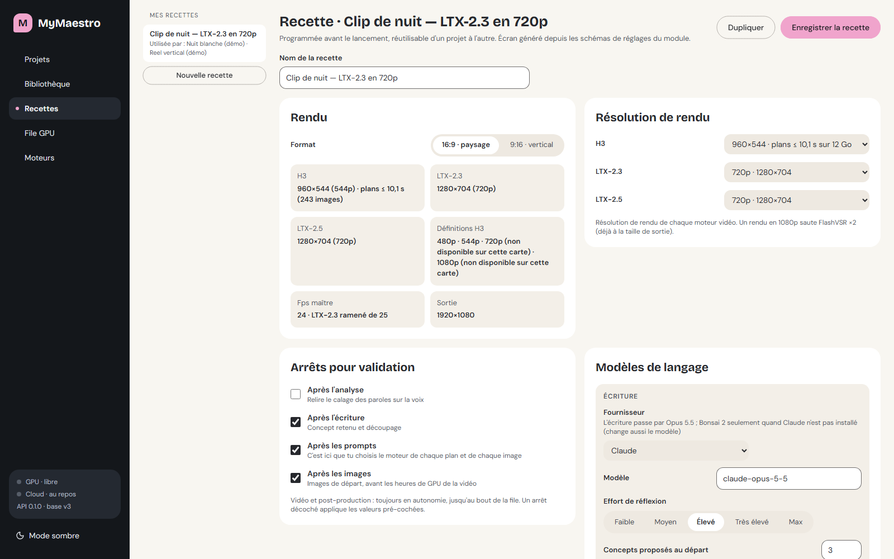
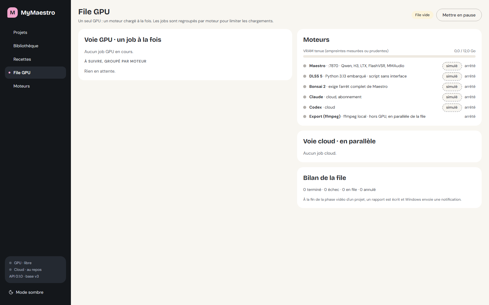
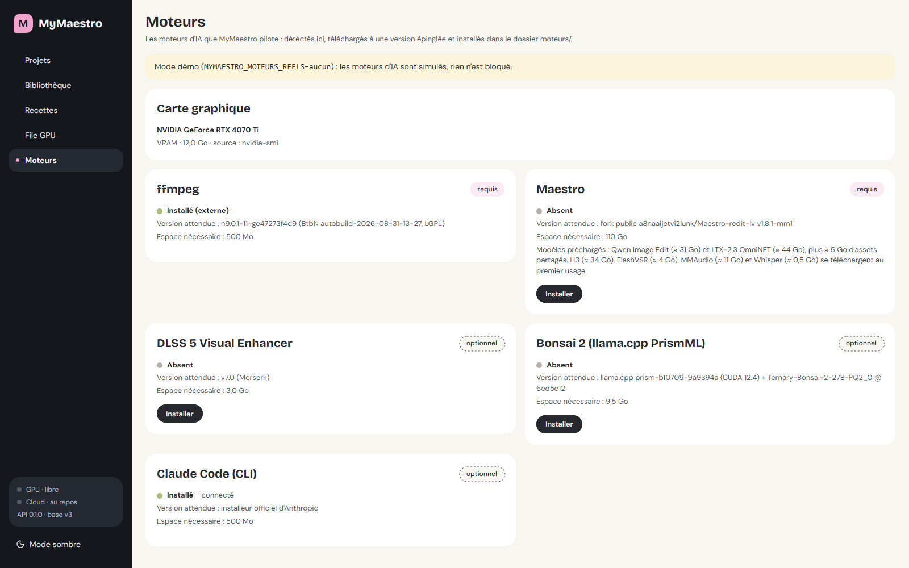
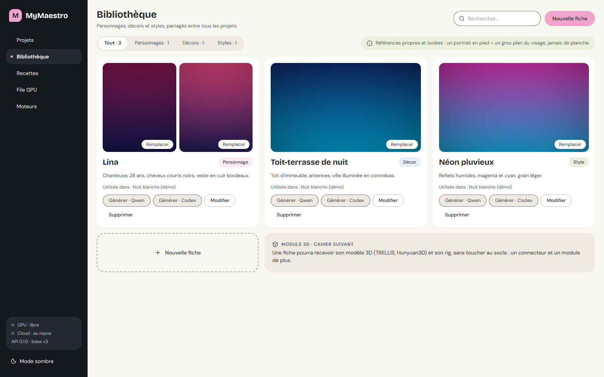

# MyMaestro

[English](#english) · [Français](#français)

---

<a id="english"></a>

## English

**A local studio that turns a song into a finished music video, on your own NVIDIA GPU.**


[](https://github.com/a8naaijetvi2lunk/MyMaestro/actions/workflows/ci.yml)



MyMaestro is a modular local studio (FastAPI + SQLite on the back end, React on the front end). It drives several AI engines that stay on your machine, queues their work on a single GPU, and gives you one place to direct, review and edit the result. The interface is in French; this README is bilingual.

### What it does

The Director module walks a song through the whole chain:

1. **Song**: you provide the audio file (and the lyrics, if you have them).
2. **Analysis**: sections, beats and lyric timing.
3. **Writing**: concepts, brief and shot breakdown.
4. **Prompts**: one prompt per shot, plus the engine chosen for each.
5. **Images**: one starting image per shot.
6. **Video**: rendering, shot by shot, on the GPU queue.
7. **Post-production**: FlashVSR upscaling and the optional DLSS 5 neural-rendering pass. Sound effects (MMAudio) are a separate action.
8. **Timeline and export**: editing with takes, preview against the song, then export in 1080p, with an optional 60 fps interpolation.

### Screenshots

Taken in demo mode, with the demo project "Nuit blanche".

| Screen | Caption |
|---|---|
|  | Projects: the home screen, with the demo projects. |
|  | Writing: concepts, brief and shot breakdown. |
|  | Prompts: one prompt per shot, with its engine. |
|  | Recipe: the engines and settings used at each step. |
|  | Queue: the jobs waiting for the single GPU. |
|  | Engines: install status and the detected graphics card. |
|  | Library: characters, sets and styles, shared across projects. |

### Engines

MyMaestro does not contain any engine: it downloads them at install time and drives them. See [`docs/moteurs.md`](docs/moteurs.md) for details.

| Engine | Role | Required | Download | Disk space needed |
|---|---|---|---|---|
| Maestro (WanGP fork) | Analysis, images and video rendering | Required | the archive, the Python dependencies and the preloaded models (Qwen about 31 GB, LTX-2.3 about 44 GB, assets about 5 GB); H3 about 34 GB, FlashVSR about 4 GB, MMAudio about 11 GB and Whisper about 0.5 GB come on first use | about 110 GB at install (plus about 50 GB for the first-use models) |
| ffmpeg | Montage, export, audio tools | Required | 0.15 GB | 0.5 GB |
| DLSS 5 Visual Enhancer | Neural-rendering pass and 60 fps interpolation | Optional | 0.5 GB | 3 GB |
| Bonsai (llama.cpp + model) | Local writing and prompts (image, video, sound) | Optional | about 7.9 GB | 9.5 GB |
| Claude Code CLI | Writing (Opus by default) and the prompts, through your own subscription | Optional (Claude or Bonsai, at least one, to write a clip) | small (official installer) | 0.5 GB |

Writing goes through Claude (Opus) by default, and so do the prompts. Without Claude, new recipes (and the demo recipe) put the writing and the prompts on Bonsai instead. With neither of them installed, writing is blocked with a message pointing to the Moteurs screen. If Bonsai fails on a prompt, the same job is retried on Claude when it is installed. DLSS 5 is optional: when it is neither installed nor external, the DLSS 5 pass is switched off by default in new recipes, and there is no 60 fps interpolation.

Outside demo mode, a job that targets an engine that is not installed fails right away with a "not installed" message (nothing is run in its place); the Moteurs screen tells you what to install.

### Requirements

- Windows 10 or 11, 64-bit.
- An NVIDIA GPU; 12 GB of VRAM is recommended (the project was developed and measured on a 12 GB card).
- **Committed memory**: 64 GB of RAM, or a large page file. Heavy video models can push committed memory up by about 50 GB; when the limit is reached, the engine dies without a trace. MyMaestro checks a margin before starting Maestro (55 GB by default) and refuses to start below it. See [`docs/depannage.md`](docs/depannage.md).
- Free disk space: the engines and their models take roughly 170 GB (figures from the install manifest and its notes), and every render exists twice (once in the project, once in Maestro's output folder).
- A Claude subscription and the `claude` CLI, or Bonsai, to write a clip (the application itself starts without them).

### Install

1. Download the latest release (the interface is already built) and unzip it.
2. Run `INSTALLER.bat`: it checks for the NVIDIA driver, installs [uv](https://docs.astral.sh/uv/) if needed and the server's Python dependencies, then offers to start MyMaestro.
3. Run `DEMARRER-MYMAESTRO.bat`; it opens http://127.0.0.1:7900.
4. Open the **Moteurs** screen (you are taken there on first launch if a required engine is missing) and install the engines: each one is downloaded at a pinned version, checked against its fingerprint, and installed in `moteurs/<engine>`, with live progress.

Details: [`docs/installation.md`](docs/installation.md).

### Try it without a GPU

MyMaestro ships demo projects ("Nuit blanche (démo)" and a vertical reel) and can run with every AI engine simulated (ffmpeg is still required: install it from the Moteurs screen or put it on the PATH). In one console:

```bat
set MYMAESTRO_MOTEURS_REELS=aucun
INSTALLER.bat
```

Without an NVIDIA driver, `INSTALLER.bat` carries on in demo mode instead of stopping. Answer `O` (yes) to its final question: it starts MyMaestro in a new window, which inherits the variable. Do not run `DEMARRER-MYMAESTRO.bat` as well: that would start a second server.

`MYMAESTRO_MOTEURS_REELS` is optional. When it is not set, the engines driven for real are the ones that are installed or external. `aucun` simulates all of them (demo mode), and a list such as `maestro,bonsai` takes precedence over the detection.

### Documentation

[Installation](docs/installation.md) · [Engines](docs/moteurs.md) · [Troubleshooting](docs/depannage.md) · [Architecture](docs/architecture.md)

### License and credits

MyMaestro is released under the [MIT license](LICENSE). The engines it drives keep their own licenses, listed in [`NOTICE.md`](NOTICE.md). In particular, Maestro is built on WanGP (non-commercial license): videos produced with it may be used commercially only if the distribution clearly states they were produced with WanGP, with a link to the WanGP repository.

---

<a id="français"></a>

## Français

**Un studio local qui transforme une chanson en clip musical terminé, sur votre propre GPU NVIDIA.**


[](https://github.com/a8naaijetvi2lunk/MyMaestro/actions/workflows/ci.yml)


MyMaestro est un studio local modulaire (FastAPI et SQLite côté serveur, React côté interface). Il pilote plusieurs moteurs d'IA qui restent sur votre machine, met leur travail en file sur un seul GPU, et offre un endroit unique pour diriger, relire et monter le résultat. L'interface est en français.

### Ce que fait MyMaestro

Le module Director fait passer une chanson par toute la chaîne :

1. **Chanson** : vous fournissez le fichier audio (et les paroles si vous les avez).
2. **Analyse** : sections, temps forts et calage des paroles.
3. **Écriture** : concepts, brief et découpage en plans.
4. **Prompts** : un prompt par plan, avec le moteur choisi pour chacun.
5. **Images** : une image de départ par plan.
6. **Vidéo** : rendu plan par plan, dans la file GPU.
7. **Post-production** : agrandissement FlashVSR et passe de rendu neuronal DLSS 5 facultative. Les bruitages (MMAudio) sont une action à part.
8. **Timeline et export** : montage avec prises, aperçu calé sur la chanson, puis export en 1080p, avec interpolation 60 images par seconde facultative.

### Captures

Prises en mode démo, avec le projet de démonstration « Nuit blanche ».

| Écran | Légende |
|---|---|
|  | Projets : l'écran d'accueil, avec les projets de démonstration. |
|  | Écriture : concepts, brief et découpage en plans. |
|  | Prompts : un prompt par plan, avec son moteur. |
|  | Recette : les moteurs et réglages utilisés à chaque étape. |
|  | File : les jobs en attente du GPU unique. |
|  | Moteurs : état d'installation et carte graphique détectée. |
|  | Bibliothèque : personnages, décors et styles, partagés entre tous les projets. |

### Moteurs

MyMaestro ne contient aucun moteur : il les télécharge à l'installation et les pilote. Détails dans [`docs/moteurs.md`](docs/moteurs.md).

| Moteur | Rôle | Requis | Téléchargement | Espace disque nécessaire |
|---|---|---|---|---|
| Maestro (fork de WanGP) | Analyse, images et rendu vidéo | Requis | l'archive, les dépendances Python et les modèles préchargés (Qwen ≈ 31 Go, LTX-2.3 ≈ 44 Go, assets ≈ 5 Go) ; H3 ≈ 34 Go, FlashVSR ≈ 4 Go, MMAudio ≈ 11 Go et Whisper ≈ 0,5 Go au premier usage | environ 110 Go à l'installation (plus environ 50 Go de modèles au premier usage) |
| ffmpeg | Montage, export, outils audio | Requis | 0,15 Go | 0,5 Go |
| DLSS 5 Visual Enhancer | Passe de rendu neuronal et interpolation 60 i/s | Facultatif | 0,5 Go | 3 Go |
| Bonsai (llama.cpp + modèle) | Écriture et prompts en local (image, vidéo, son) | Facultatif | environ 7,9 Go | 9,5 Go |
| CLI Claude Code | Écriture (Opus par défaut) et prompts, avec votre propre abonnement | Facultatif (Claude ou Bonsai, au moins un, pour écrire un clip) | faible (installeur officiel) | 0,5 Go |

L'écriture passe par Claude (Opus) par défaut, de même que les prompts. Sans Claude, les nouvelles recettes (et la recette de démo) confient l'écriture et les prompts à Bonsai. Sans aucun des deux, l'écriture est bloquée, avec un message qui renvoie à l'écran Moteurs. Si Bonsai échoue sur un prompt, le même travail repart sur Claude s'il est installé. DLSS 5 est facultatif : quand il n'est ni installé ni externe, la passe DLSS 5 est désactivée par défaut dans les nouvelles recettes, et il n'y a pas d'interpolation 60 i/s.

Hors mode démo, un job qui vise un moteur non installé échoue aussitôt avec un message « non installé » (rien ne s'exécute à sa place) ; l'écran Moteurs dit quoi installer.

### Prérequis

- Windows 10 ou 11, 64 bits.
- Une carte NVIDIA ; 12 Go de VRAM recommandés (le projet a été développé et mesuré sur une carte de 12 Go).
- **Mémoire engagée** : 64 Go de RAM, ou un grand fichier d'échange. Les gros modèles vidéo peuvent faire monter la mémoire engagée d'environ 50 Go ; à la limite, le moteur meurt sans laisser de trace. MyMaestro contrôle une marge avant de démarrer Maestro (55 Go par défaut) et refuse de le lancer en dessous. Voir [`docs/depannage.md`](docs/depannage.md).
- Espace disque : les moteurs et leurs modèles occupent environ 170 Go (chiffres du manifeste d'installation et de ses notes), et chaque rendu existe en double (dans le projet et dans le dossier de sortie de Maestro).
- Un abonnement Claude et la CLI `claude`, ou Bonsai, pour écrire un clip (l'application démarre sans eux).

### Installation

1. Téléchargez la dernière release (l'interface est déjà construite) et décompressez-la.
2. Lancez `INSTALLER.bat` : il contrôle le pilote NVIDIA, installe [uv](https://docs.astral.sh/uv/) si besoin et les dépendances Python du serveur, puis propose de lancer MyMaestro.
3. Lancez `DEMARRER-MYMAESTRO.bat` ; il ouvre http://127.0.0.1:7900.
4. Ouvrez l'écran **Moteurs** (au premier lancement, vous y êtes amené si un moteur requis manque) et installez les moteurs : chacun est téléchargé à une version épinglée, son empreinte est vérifiée, puis il est installé dans `moteurs/<moteur>`, avec la progression en direct.

Détails : [`docs/installation.md`](docs/installation.md).

### Essayer sans GPU

MyMaestro fournit des projets de démonstration (« Nuit blanche (démo) » et un reel vertical) et peut tourner avec tous les moteurs d'IA simulés (ffmpeg reste nécessaire : installez-le depuis l'écran Moteurs ou placez-le dans le PATH). Dans une même console :

```bat
set MYMAESTRO_MOTEURS_REELS=aucun
INSTALLER.bat
```

Sans pilote NVIDIA, `INSTALLER.bat` poursuit en mode démo au lieu de s'arrêter. Répondez `O` à sa question finale : il lance MyMaestro dans une nouvelle fenêtre, qui hérite de la variable. Ne lancez pas `DEMARRER-MYMAESTRO.bat` en plus : cela démarrerait un second serveur.

`MYMAESTRO_MOTEURS_REELS` est facultative. Absente, les moteurs pilotés pour de vrai sont ceux qui sont installés ou externes. `aucun` les simule tous (mode démo), et une liste comme `maestro,bonsai` l'emporte sur la détection.

### Documentation

[Installation](docs/installation.md) · [Moteurs](docs/moteurs.md) · [Dépannage](docs/depannage.md) · [Architecture](docs/architecture.md)

### Licence et crédits

MyMaestro est publié sous [licence MIT](LICENSE). Les moteurs qu'il pilote gardent leurs propres licences, listées dans [`NOTICE.md`](NOTICE.md). En particulier, Maestro repose sur WanGP (licence non commerciale) : les vidéos produites ne peuvent être diffusées commercialement que si la diffusion indique clairement qu'elles ont été produites avec WanGP, avec un lien vers le dépôt WanGP.
